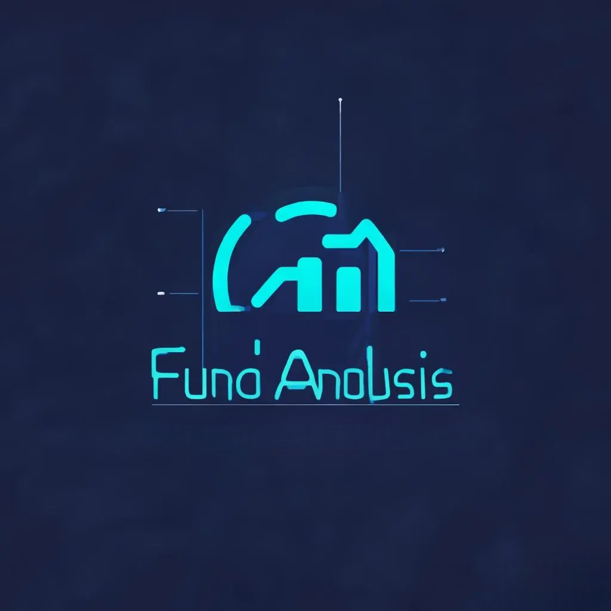

# 基金持仓分析系统

<p align="center">
  
</p>

<p align="center">
  <a href="#功能特性">功能特性</a> •
  <a href="#快速开始">快速开始</a> •
  <a href="#技术架构">技术架构</a> •
  <a href="#API文档">API文档</a> •
  <a href="#开发计划">开发计划</a>
</p>

<p align="center">
  
  
  
</p>

## 📖 项目介绍

基金持仓分析系统是一个基于 Dash 和 Ant Design 构建的基金投资组合可视化分析工具。本项目旨在帮助投资者更好地管理和分析其基金投资组合。

> ⚠️ 注意：这是一个用于学习 Dash 的练手项目，目前还在开发中，请勿用于生产环境。

## ✨ 功能特性

- 📊 基金投资组合可视化分析
- 💼 多账户管理与切换
- 📈 持仓分析与收益计算
- 🔄 自动数据同步更新
- 📱 响应式界面设计

## 🚀 快速开始

### 环境要求

- Python 3.8+
- SQLite3
- Node.js 14+ (可选，用于前端开发)

### 安装步骤

1. 克隆仓库
```bash
git clone https://github.com/yourusername/fund-analysis.git
cd fund-analysis
```

2. 运行应用
```bash
./start.sh
```
访问 http://localhost:8050 即可使用系统。API文档地址: http://localhost:8050/api/doc

## 🏗️ 技术架构

### 前端技术栈
- Dash Framework - 构建交互式 Web 应用
- Plotly.js - 数据可视化
- Feffery Ant Design Components - UI 组件库

### 后端技术栈
- Flask - Web 框架
- Flask-RESTX - RESTful API 框架
- SQLite3 - 数据存储
- Peewee ORM - 对象关系映射

## 📁 项目结构
```
fund-analysis/
├── app.py # 主应用程序入口
├── backend/ # 后端API实现
├── components/ # 前端可复用组件
├── models/ # 数据模型定义
├── pages/ # 页面组件
├── utils/ # 工具函数
├── config.py # 配置文件
└── requirements.txt # 项目依赖
```

## 📚 API 文档

### 运行时 API
| 接口 | 方法 | 描述 |
|------|------|------|
| `/api/runtime/status` | GET | 获取系统运行状态 |

### 账户管理 API
| 接口 | 方法 | 描述 |
|------|------|------|
| `/api/accounts` | GET | 获取账户列表 |
| `/api/accounts` | POST | 创建新账户 |
| `/api/accounts/<id>` | GET | 获取账户详情 |

更多 API 详情请参考 [API 文档](http://localhost:8050/api/doc)

## 📋 开发计划

- [x] 基础框架搭建
- [x] 数据模型设计
- [x] RESTful API 实现
- [x] 统一响应格式
- [x] ORM 集成
- [x] 账户管理功能
- [x] 数据库迁移
- [x] vscode/cursor 调试配置
- [x] 业务组件：基金代码选择器
- [x] 数据源管理
- [ ] 基金数据导入
- [ ] 持仓分析功能
- [ ] 收益分析功能
- [ ] 风险评估模块

## 🤝 贡献指南

欢迎贡献代码！请查看 [CONTRIBUTING.md](CONTRIBUTING.md) 了解如何参与项目开发。

## 📄 许可证

本项目采用 MIT 许可证 - 查看 [LICENSE](LICENSE) 了解详情

## 📮 联系方式

如有问题或建议，欢迎提 Issue 或 PR。

---

如果这个项目对你有帮助，欢迎 star ⭐️
